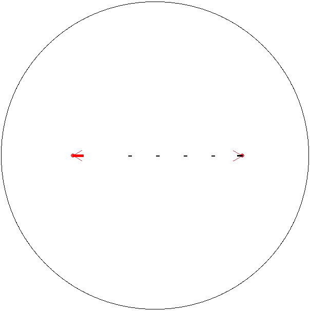

# Genetic-Fighters WIP

Fighter testing for v0.1.7

## Description
This project is a "Hunger Games"/"Battle Royale" simulation of little fighters which must survive a closing arena and eachother.  Using a neural network of 2 hidden layers as each fighter's "brain", a genetic algorithm will produce more advanced fighters with each generation.  

## Genetic Algorithm Design
Fitness function: 1 point for each second survived + 20 points for each fighter that died before it
Parent selection: Roulette wheel
Crossover: Biased one-point crossover of genes
Mutation: Random-resetting of chromosomes
Survivor selection: At least two nonsurvivors, at most 25% nonsurvivors

## Neural Network Design
Input: Variety of factors, such as: players in sight, weapons in sight, distance to boundary, projectiles in sight, etc.
Hidden layers: 2 hidden layers normalized using sigmoid
Output: Four nodes: move forward, turn left, turn right, or fire

## Steps Remaining
1. Build and test Mastermind() algorithms
2. Implement check_collision() in weapon.py
3. Turn game.py into game class which can be called by Mastermind()
4. Attach neural network to Player() and test actions
5. Let Mastermind() run game and find fitness values of fighters
6. Add info panel to game window

## Built With

* [pygame](http://www.pygame.org/news) - Graphics

## License

This project is licensed under the MIT License - see the [LICENSE.md](LICENSE.md) file for details
